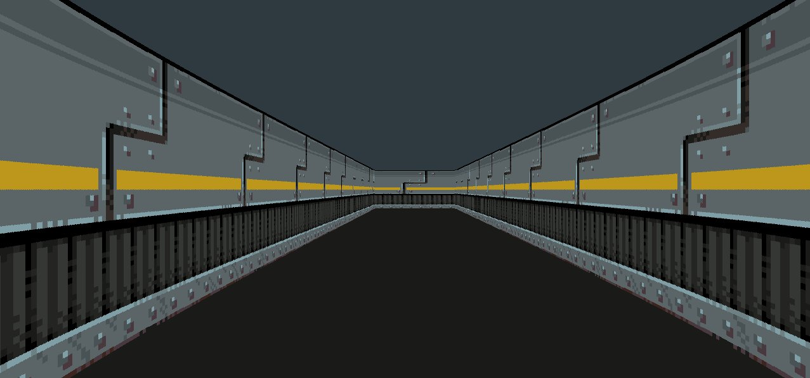
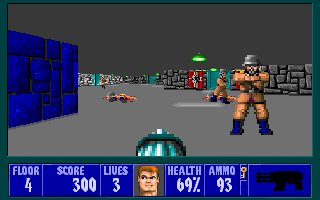
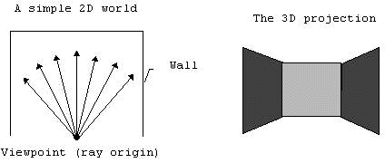
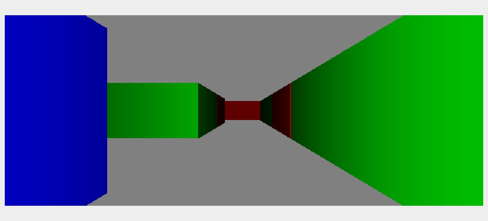

*This project has been created as part of the 42 curriculum by mobouifr, mamir.*
<div align="center">

# cub3D
### A first-person raycaster built from a 2D map — inspired by Wolfenstein 3D.

</div>

<div align="center">


</div>


<div align="center">
  
  <sub>In-game view — industrial corridor rendered via raycasting</sub>
</div>

---

## Description

In 1992, id Software released **Wolfenstein 3D** — the game that invented the first-person shooter. It ran on hardware with no 3D acceleration whatsoever. The trick was raycasting: instead of rendering a 3D world, you cast one ray per screen column from a 2D map, measure where it hits a wall, and draw a vertical slice proportional to that distance. Repeated for every column on screen, it produces the illusion of depth.

<div align="center">
  

  <sub>Wolfenstein 3D (1992) — the technique cub3D reimplements from scratch</sub>
</div>

cub3D is a 42 project that replicates that technique in C. Every subsystem is written by hand: a custom `.cub` scene file parser, map validation, texture loading, real-time player movement with collision detection, and a per-column rendering loop using the DDA algorithm. No game engine. No 3D library. Just math, file descriptors, and MiniLibX.

Building it forces you to understand how 2D grids map to 3D screens, how coordinate systems work under rotation, how file descriptors and image buffers connect, and how to keep a render loop stable enough to feel smooth.

---

## How raycasting works

Each frame, the player casts one ray per screen column. The ray starts at the player's position, points at a specific angle within the field of view, and steps through the 2D map grid using the **DDA algorithm** (Digital Differential Analyzer) until it hits a wall cell. DDA avoids checking every pixel — instead it computes the exact distance to the next vertical grid boundary and the next horizontal one, then steps toward whichever is closer.

<div align="center">
  
</div>

Once the ray hits a wall, two things happen: the perpendicular distance determines how tall the wall slice appears on screen (close = tall, far = short), and the hit side (N/S/E/W) plus hit position within the cell determine which texture to sample and at which column.

<div align="center">
  
  
  <sub>Each wall face gets its own color or texture — direction determines which</sub>
</div>

The result is a smooth first-person view from a flat data structure. No geometry, no depth buffer, no 3D transforms.

---

## Features

| Feature | Status | Details |
|---|---|---|
| Directional wall textures (N/S/E/W) | ✓ | Four texture paths loaded at startup, ray hit side selects which to sample |
| Floor and ceiling solid colors | ✓ | `F` and `C` lines parsed into RGB and drawn as full-screen background bands |
| WASD movement | ✓ | Forward/backward and lateral strafe |
| Arrow key rotation | ✓ | Left/right arrows rotate the camera |
| ESC and window-close exit | ✓ | Both paths call the shutdown routine cleanly |
| `.cub` file parsing | ✓ | Textures, colors, and map rows fully parsed |
| Map validation | ✓ | Checks valid characters, one spawn point, outer wall closure |
| `Error\n` + message on failure | Partial | Failures are caught and reported — prefix not yet standardized |
| Wall collisions | ✓ | Movement blocked by wall cells using a collision radius |
| Minimap | — | Not implemented |
| Doors | — | Not implemented |
| Animated sprites | — | Not implemented |
| Mouse rotation | — | Keyboard-only |

---

## The `.cub` scene file format

A scene file defines the four wall textures, floor color, ceiling color, and then the map. The map must always be last. Everything else can appear in any order.

```
NO path/to/north_texture.xpm
SO path/to/south_texture.xpm
WE path/to/west_texture.xpm
EA path/to/east_texture.xpm
F R,G,B
C R,G,B

111111
100001
10N001
100001
111111
```

**Map characters:** `1` wall · `0` empty · `N` `S` `E` `W` player spawn + facing direction

**Validation rules:**
- All six config lines must appear before the map
- Texture files must exist on disk
- RGB values must be in range `[0, 255]`
- Exactly one player spawn character
- The map must be fully enclosed by walls
- Unknown characters cause the parser to exit with `Error\n`

**Example from this repo:**

```
NO textures/TECH_3B.xpm
SO textures/TECH_3B.xpm
WE textures/TECH_1C.xpm
EA textures/TECH_1C.xpm
F 26,26,24
C 46,58,63

111111
100001
100N01
100001
111111
```

---

## Project structure

```
cub3D/
├── Makefile
├── .gitignore
├── includes/
│   ├── cub3d.h              # main header — game structs and prototypes
│   ├── get_next_line.h
│   └── libft.h
├── maps/
│   ├── map.cub              # main test map
│   └── test.cub             # minimal validation map
├── src/
│   ├── main.c               # entry point and game loop bootstrap
│   ├── mlx.c                # window/image setup, pixel writing, cleanup
│   ├── rendering.c          # background fill and frame composition
│   ├── rays.c               # raycasting loop
│   ├── ray_helper_1.c       # DDA setup and grid stepping
│   ├── ray_helper_2.c       # wall coords and texture column helpers
│   ├── player_movement.c    # collision-aware movement and rotation
│   ├── handle_input.c       # keyboard press/release handling
│   ├── init_data.c          # runtime state initialization
│   ├── parser/              # scene file parsing and map building
│   └── textures/
│       └── texture_utils.c  # XPM loading and texel access
├── screenshots/             # images used in this README
├── textures/                # XPM wall texture assets
├── utils/
│   ├── get_next_line/       # line reader used by the parser
│   └── libft/               # local libft with its own Makefile
└── mlx_linux/               # bundled MiniLibX for Linux builds
```

---

## Controls

| Key | Action |
|---|---|
| `W` | Move forward |
| `S` | Move backward |
| `A` | Strafe left |
| `D` | Strafe right |
| `←` | Rotate left |
| `→` | Rotate right |
| `ESC` | Quit |

---

## Getting started

### Requirements

- OS: Linux or macOS
- Compiler: `cc` with `-Wall -Wextra -Werror`
- Linux: requires X11 headers

```bash
# Ubuntu / Debian
sudo apt-get install gcc make xorg libxext-dev libbsd-dev

# Arch
sudo pacman -S gcc make libxext libx11 libbsd

# macOS
xcode-select --install
```

### Build and run

```bash
git clone <repo-url>
cd cub3D
make
./cub3D maps/map.cub
```

### Makefile rules

| Rule | Effect |
|---|---|
| `make` | Compile `cub3D` |
| `make clean` | Remove object files |
| `make fclean` | Remove objects, binary, and bundled archives |
| `make re` | Full rebuild |

---

## Resources

- [Lode's raycasting tutorial](https://lodev.org/cgtutor/raycasting.html) — the definitive reference for this project
- [MiniLibX documentation](https://harm-smits.github.io/42docs/libs/minilibx)
- `man 2 open` · `man 2 read` · `man 2 close` · `man 2 gettimeofday` · `man 3 math`
- [DDA algorithm](https://en.wikipedia.org/wiki/Digital_differential_analyzer_(graphics_algorithm))

